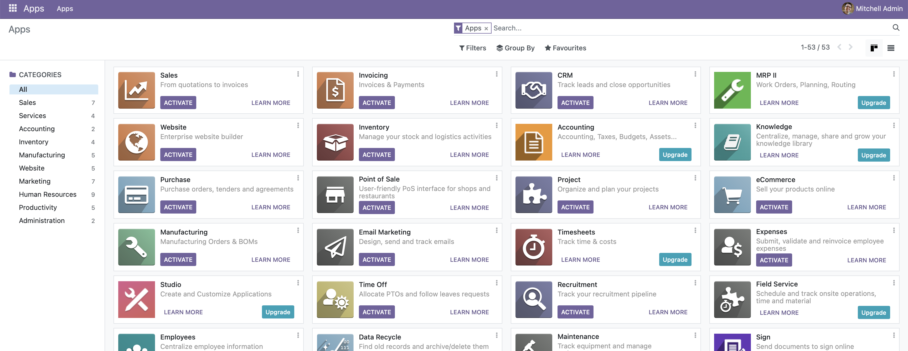
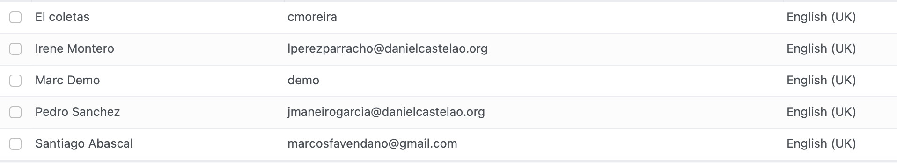
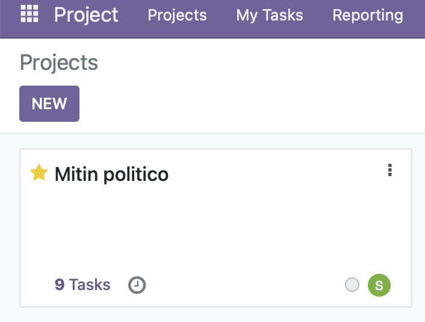

# LEVANTAMOS SERVICIOS ODOO 
# ==========================
### 1. Instalamos docker-compose
```bash
/**
 * Docker Compose Configuration File
 *
 * This YAML file defines a Docker Compose configuration with two services: "web" and "mydb".
 * The "web" service uses the Odoo image (version 16.0) and depends on the "mydb" service.
 * The "mydb" service uses the PostgreSQL image (version 15) and provides the database for Odoo.
 *
 * Version: 3.1
 */

version: '3.1'  // Especifica la versión de la configuración de Docker Compose que se utilizará.

services:
  // Servicio "web" que utiliza la imagen de Odoo (versión 16.0).
  web:
    image: odoo:16.0  // Establece la imagen Docker para el servicio "web".
    depends_on:
      - mydb  // Indica que este servicio depende de que el servicio "mydb" esté disponible.
    ports:
      - "8069:8069"  // Mapea el puerto 8069 del host al puerto 8069 del contenedor.
    environment:
      - HOST=mydb  // Configura la variable de entorno HOST con el valor "mydb".
      - USER=odoo  // Configura la variable de entorno USER con el valor "odoo".
      - PASSWORD=myodoo  // Configura la variable de entorno PASSWORD con el valor "myodoo".

  // Servicio "mydb" que utiliza la imagen de PostgreSQL (versión 15).
  mydb:
    image: postgres:15  // Establece la imagen Docker para el servicio "mydb".
    environment:
      - POSTGRES_DB=postgres  // Configura la variable de entorno POSTGRES_DB con el valor "postgres".
      - POSTGRES_PASSWORD=myodoo  // Configura la variable de entorno POSTGRES_PASSWORD con el valor "myodoo".
      - POSTGRES_USER=odoo  // Configura la variable de entorno POSTGRES_USER con el valor "odoo".

```
### 2. Levantamos los servicios

Para esto lo que debemos hacer es levantar la base de datos, vamso a trabajar con **PostgreSQL** y luego levantamos el servicio de **Odoo**.

```bash
docker-compose up -d 
```
### 3. Verificamos que los servicios esten levantados

```bash
docker-compose ps
```
### 4. Accedemos a Odoo

```bash
http://localhost:8069
```



# LEVANTAMOS UN PROJECT EN ODOO
# ==============================

### 1. Busqueda de project

Buscamos project en el buscador de Odoo y lo instalamos

Además hemos creado 3 nuevos perfiles y no el Mitchel por defecto, como nuestro proyecto será
sobre un **mitin** politico, hemos creado los siguientes perfiles:



### 2. Creamos un nuevo proyecto



En este proyecto estructuraremos los diferentes temas a tratar en el miting politico


Como podemos comprobar, hemos creado un proyecto con 4 tareas, cada una de ellas diferentes responsables.


